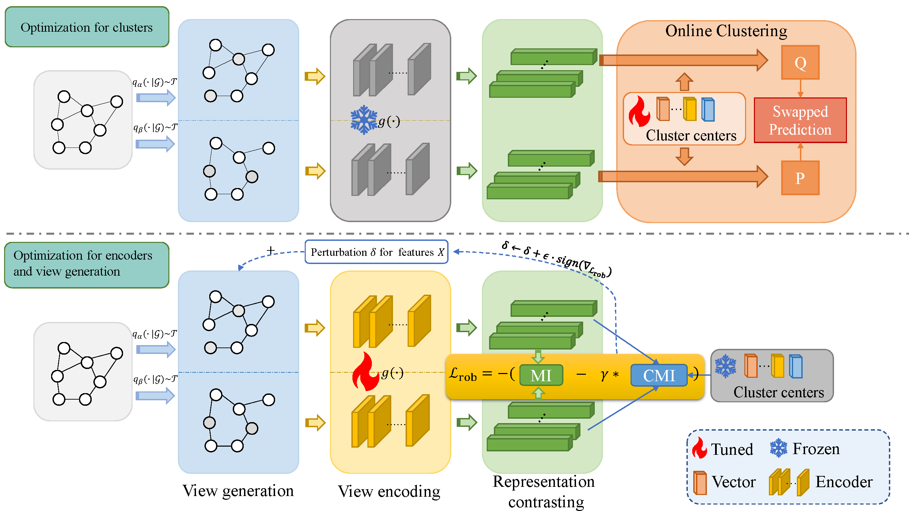

# Framework
The optimization process comprises two steps. In the initial step, we optimize the cluster centers and freeze other parameters through a swapped prediction task (Equation 17). Due to the relatively small size of the parameters associated with cluster centers, this step is efficient. In our experiments, we iterate through this step 10 times. Following this, we proceed to optimize the parameters of the encoder and perturbation( with frozen cluster centers). For this, we employ min-max optimization for the encoder's parameters and perturbation (Equation 12). The inner loop involves three iterations, and we accumulate the gradients for updating the model's parameters. Consequently, this step is also efficient when compared to GRACE.



## How to run?

`python unsupervised.py --config_path GOODCBAS/color/concept/MARIO.yaml --ad_aug`

`python unsupervised.py --config_path GOODWebKB/university/concept/MARIO.yaml --ad_aug`

Our codes are built up on [GOOD](https://github.com/divelab/GOOD).

## Requirements:

CUDA 12.1, for other version, you can refer to their official websites.

```
pip install torch_geometric
```

```
pip install pyg_lib torch_scatter torch_sparse torch_cluster torch_spline_conv -f https://data.pyg.org/whl/torch-2.1.0+cu121.html
```

`pip install munch ruamel_yaml typed-argument-parser cilog gdown dive_into_graphs tensorboard rich`
